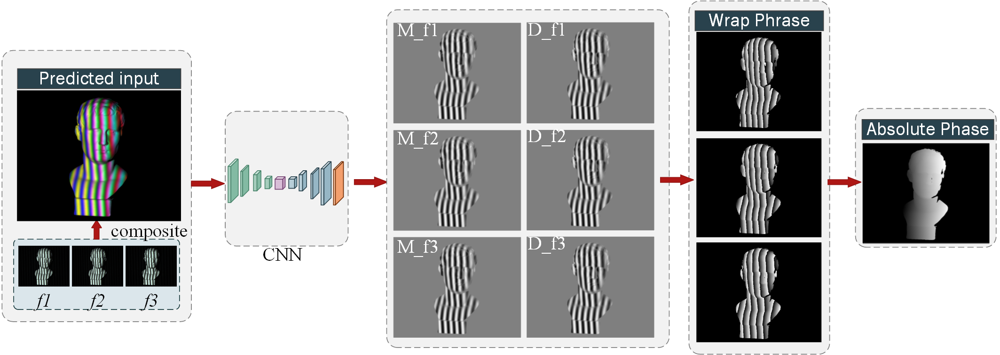

Here's the polished English version of your README section:

---

# A U-Net-Based Phase Unwrapping Method

This project presents a phase unwrapping approach based on a U-Net architecture. The input is a synthetic image composed of three different frequencies. The model predicts the numerator and denominator of the wrapped phase. Then, a multi-frequency heterodyne method is used to compute the absolute phase. The resulting absolute phase achieves an RMSE of approximately 0.05 radians.




## Data Augmentation

This project provides data augmentation capabilities with two data loading modes:

* `datasetRead_0` mode: Supports random translation and rotation for data augmentation.
* `datasetRead` mode: Supports all available augmentation methods defined in the code.


## Training

```bash
python train.py
```

---

